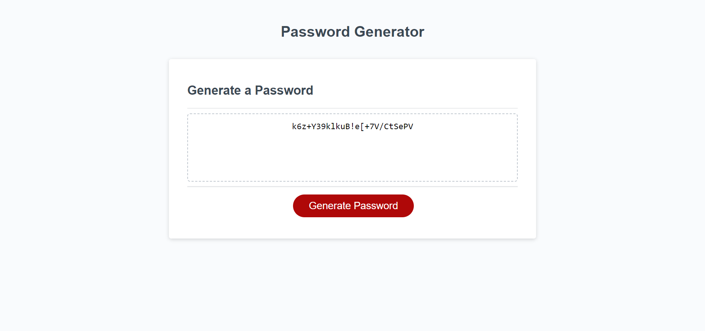

# A Password Generator Powered by JavaScript (Challenge: Week 5)

## Description
The purpose of this project was to make a random password generator using code written in JavaScript. A simple interface presents a button to be clicked by the user to generate a password. Once this is clicked a series of prompts allow the user to tailor the length of the password and the type of characters to be included. Two 'while' loops ensure that the user enters appropriate information. The first checks to make sure that the user has entered a number and that this numbers lies between 10 and 64 characters; the second verifies that at least one of four different character types has been selected, from which the password will be constructed. These character types include: lower-case letters, upper-case letters, numbers and symbols. Both 'while' loops continue to prompt the user until correct information has been submitted. A third 'while' loop generates the password. This loop contains two random processes. The first selects a number corresponding to one of the four arrays each containing characters of different types stored as strings. If the number of the array is selected and the user has chosen that type of character to be included in his or her password a second random number corresponding to a string within the array will be generated and this character will be added to a password array. This means not only that characters from within an array will be selected randomly but also that the arrays themselves will be selected at random, thereby ensuring a greater degree of randomness in the construction of passwords for added security. The 'while' loop will run until the 'password' array is of equal length to that desired by the user. Once the password is complete it is printed within a textbox in the user interface.

## Installation
N/A

## Usage
To begin the process of creating a password click the 'Generate Password' button. Once a user has generated a password a new password may be created by refreshing the page and clicking the 'Generate Password' button again.

## Credits
N/A

## License
N/A

## https://davidbluelamassu.github.io/Password-Generator/

